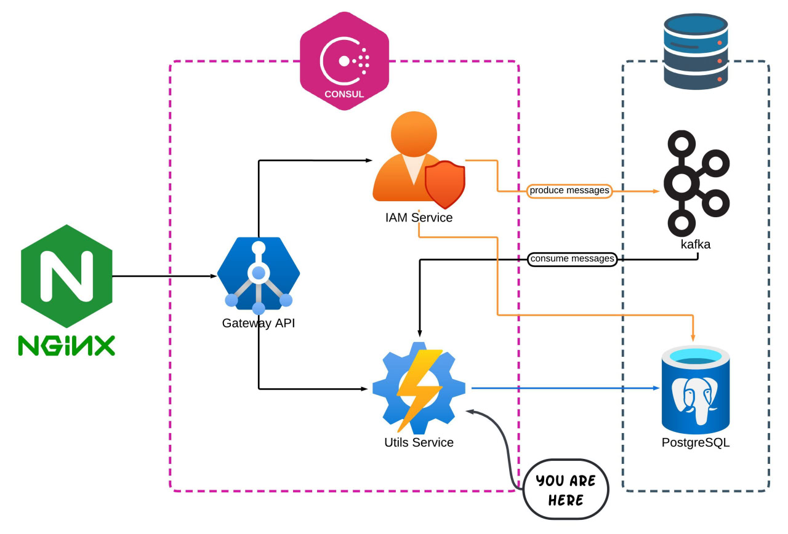

# Post-Hub • Utils-Service

> Kafka event consumer, notifications store, read/unread state

**Utils-Service** consumes domain events from **Kafka**, persists them as notifications, exposes REST APIs to fetch/filter them, and lets clients mark notifications as **read/unread**. It registers with **Consul** for discovery and exposes health/metrics via **Spring Boot Actuator**.

It is **1 of 3 core microservices**:

- [post-hub-gateway-service](https://github.com/densungkim/post-hub-gateway-service)
- **post-hub-utils-service** (this repo)
- [post-hub-iam-service](https://github.com/densungkim/post-hub-iam-service)

---

## Project overview — Post‑Hub

**Post‑Hub** is a microservice‑based social content platform where users can publish posts, comment, like, edit/delete
their content, and receive notifications about domain events.

**Components:**

* **iam-service** (this repo): Auth (registration, login, logout, refresh, password recovery), JWT, RBAC, Posts &
  Comments CRUD, domain events producer.
* **utils-service**: Kafka consumer for cross‑cutting tasks (e.g., notifications, async processing).
* **gateway-service**: Single entrypoint; routes traffic to services (deployed behind **Nginx**).
* **PostgreSQL 17.6**: primary datastore (via Spring Data JPA + Flyway).
* **Kafka 4.1.0 (KRaft)**: async communication & domain events.
* **Consul**: service discovery/registration.

**Architecture diagram:**  


---

## Service scope — IAM-Service

* **Auth**: registration, login, logout, refresh tokens, password recovery.
* **RBAC**: roles `USER`, `ADMIN`, `SUPER_ADMIN` with method/endpoint protection.
* **Content**: Posts & Comments CRUD with validation, pagination/sorting/filtering (Specification/Criteria).
* **Events**: publishes Kafka messages on CRUD operations:
    - `user.created`, `user.updated`, `user.deleted`
    - `post.created`, `post.updated`, `post.deleted`
    - `comment.created`, `comment.updated`, `comment.deleted`
* **Discovery**: registers in Consul; exposes health via Actuator.
* **API docs**: Swagger/OpenAPI

---

## Tech stack & versions

* **Java** 21
* **Spring Boot** 3.5.5
* **Spring Cloud (BOM)** 2025.0.0
* **Spring Security** (JWT via **jjwt** 0.12.6)
* **Spring Web**, **Spring Data JPA** (Hibernate), **Validation** (Jakarta)
* **PostgreSQL** 17.6 (JDBC driver 42.7.7)
* **Flyway** 11.10.1
* **MapStruct** 1.6.3 (+ annotation processor)
* **Spring Kafka**, **Spring Cloud Consul Discovery**, **Actuator**
* **OpenAPI/Swagger** via `springdoc-openapi-starter-webmvc-ui` 2.8.9

All versions are aligned with this service’s `pom.xml`.

---

## API documentation

* **Swagger UI (local service)**: `http://localhost:8185/swagger-ui/index.html`
* **OpenAPI JSON**: `http://localhost:8185/v3/api-docs`
* **Postman**: import the attached [postman_collection](postman_collection.json) file included in the repo.

> If you are running through the **gateway-service** or Nginx, the path/host may differ.

---

## Build & run

### A) Local JVM (no containers for the app)

Prereqs: Java 21, Maven 3.9+, Docker

```bash
# run infrastructure (Postgres, Kafka, Consul)
docker compose up -d

# start the service
mvn spring-boot:run
```

### B) Local Docker (default profile: [local](src/main/resources/application-local.properties)

This repo includes [utils-service.sh](docker/utils-service.sh) (entrypoint) and [Dockerfile](docker/Dockerfile).

```bash
# build jar file
mvn clean install -Dgroups='!integration'

# build image (context = repo root)
docker build -f docker/Dockerfile -t post-hub/utils-service .

# run container
docker run -d --name utils-service --network app-network -p 8185:8185 post-hub/utils-service
```

### C) Production — Docker

For production you must provide environment variables:

- JWT_SECRET
- DB_HOST, DB_NAME, DB_USERNAME, DB_PASSWORD
- KAFKA_HOST
- CONSUL_HOST

Minimal example:

```bash
docker run -d --restart unless-stopped \
  --name iam-service \
  -p 8185:8185 \
  --network app-network \
  -e PROFILE=prod \
  -e JWT_SECRET=super-secret-key \
  -e DB_HOST=postgres \
  -e DB_NAME=posthub \
  -e DB_USERNAME=posthub \
  -e DB_PASSWORD=secret \
  -e KAFKA_HOST=kafka \
  -e CONSUL_HOST=consul \
  post-hub/iam-service:latest
```

---

## Data & migrations

* **Flyway** runs automatically at startup; scripts under `src/main/resources/db/migration`.


---

## Ports (defaults)

* Utils-Service: **8185**
* PostgreSQL: **5432**
* Kafka: **9092**
* Consul: **8500**

---

## License

This project is licensed under the [MIT License](LICENSE).
